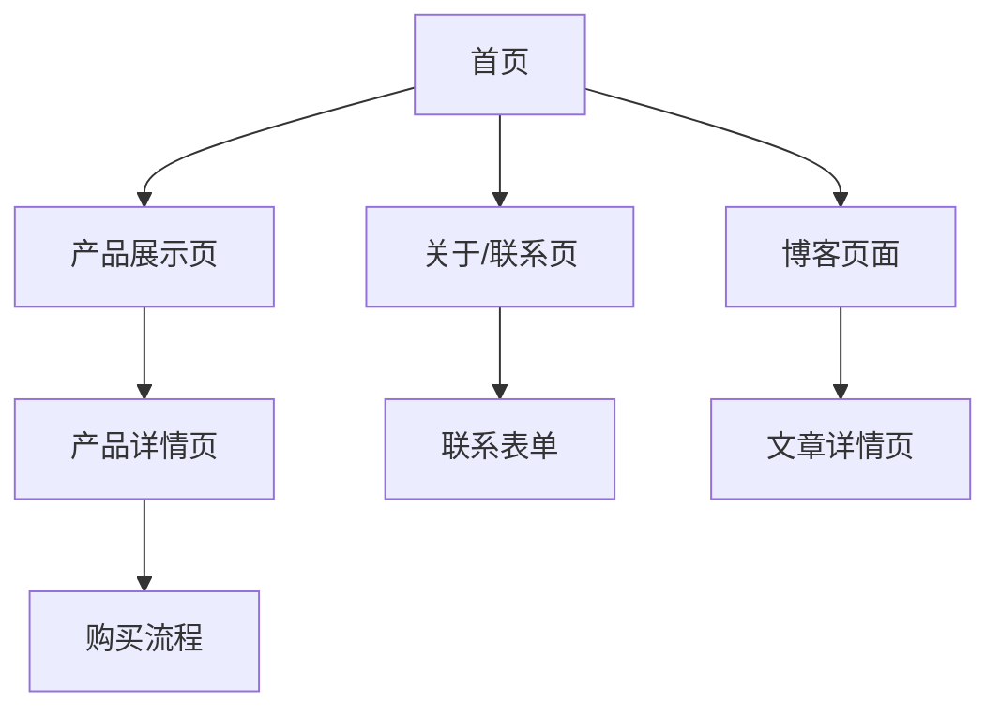

## 1. Product Overview
BridgeAI 是一个专注于 Notion 模板等数字产品展示与销售的一人公司网站。通过现代化的暗色主题设计和流畅的用户体验，向访问者展示高质量的数字产品，并提供便捷的购买渠道。

目标市场：追求高效工作流的个人用户、小型团队、数字产品爱好者。

## 2. Core Features

### 2.1 User Roles
| Role | Registration Method | Core Permissions |
|------|---------------------|------------------|
| Visitor | No registration required | Browse products, view content, contact company |
| Customer | Email registration | Purchase products, download purchases, view order history |

### 2.2 Feature Module
网站包含以下核心页面：
1. **首页**：Hero 区域、公司介绍、产品特色、模板展示、客户案例、用户评价、CTA、页脚
2. **产品展示页**：产品卡片列表、分类筛选、产品详情、购买/下载功能
3. **关于/联系页**：公司故事、联系方式、社交媒体链接
4. **博客页面**（预留）：文章列表、文章详情页

### 2.3 Page Details
| Page Name | Module Name | Feature description |
|-----------|-------------|---------------------|
| 首页 | Hero 区域 | 展示公司标语、主要产品、CTA 按钮 |
| 首页 | 公司介绍 | 简要介绍 BridgeAI 的使命和愿景 |
| 首页 | 产品特色 | 展示 Notion 模板的核心优势 |
| 首页 | 模板展示 | 轮播或网格展示热门模板 |
| 首页 | 客户案例 | 展示成功使用案例 |
| 首页 | 用户评价 | 显示客户反馈和评分 |
| 首页 | CTA 区域 | 引导用户采取行动（购买/联系） |
| 首页 | 页脚 | 导航链接、社交媒体、版权信息 |
| 产品展示页 | 产品列表 | 网格布局展示所有产品 |
| 产品展示页 | 分类筛选 | 按类型、价格、热度筛选 |
| 产品展示页 | 搜索功能 | 关键词搜索产品 |
| 产品展示页 | 产品详情 | 详细介绍、预览图、价格、购买按钮 |
| 关于/联系页 | 公司故事 | 详细介绍公司发展历程 |
| 关于/联系页 | 联系方式 | 邮箱、社交媒体链接 |
| 关于/联系页 | 联系表单 | 用户可直接发送消息 |
| 博客页面 | 文章列表 | 展示所有博客文章 |
| 博客页面 | 文章详情 | 显示文章内容、作者、发布时间 |

## 3. Core Process
### 用户浏览流程
1. 用户访问首页 → 浏览 Hero 区域和公司介绍
2. 查看产品展示 → 点击感兴趣的产品
3. 进入产品详情页 → 查看详细信息
4. 决定购买 → 点击购买按钮
5. 完成购买 → 获得下载链接

### 用户联系流程
1. 访问关于页面 → 了解公司信息
2. 查看联系方式 → 选择联系渠道
3. 填写联系表单 → 提交咨询

## 4. User Interface Design

### 4.1 Design Style
- **主色调**：深色背景 (#0F172A, #1E293B)
- **辅助色**：灰白流体图案，渐变效果
- **按钮样式**：胶囊形状，圆角设计，悬停动画
- **字体**：简洁无衬线字体 (Inter, system-ui)
- **布局风格**：卡片式布局，响应式网格
- **图标风格**：简约线条图标，与整体风格统一

### 4.2 Page Design Overview
| Page Name | Module Name | UI Elements |
|-----------|-------------|-------------|
| 首页 | Hero 区域 | 大标题字体 (3-4rem)，渐变背景动画，居中布局 |
| 首页 | 产品展示 | 卡片网格 (3列桌面，1列移动)，悬停放大效果 |
| 产品展示页 | 产品列表 | 过滤侧边栏，卡片瀑布流布局 |
| 产品详情页 | 详情展示 | 图片轮播，价格标签，购买按钮突出显示 |
| 关于页面 | 内容区域 | 时间轴布局，团队介绍卡片 |

### 4.3 Responsiveness
- **桌面优先**：针对 1440px 及以上屏幕优化
- **移动端适配**：完全响应式，支持触摸交互
- **断点**：640px, 768px, 1024px, 1280px
- **触摸优化**：按钮最小 44px，手势支持