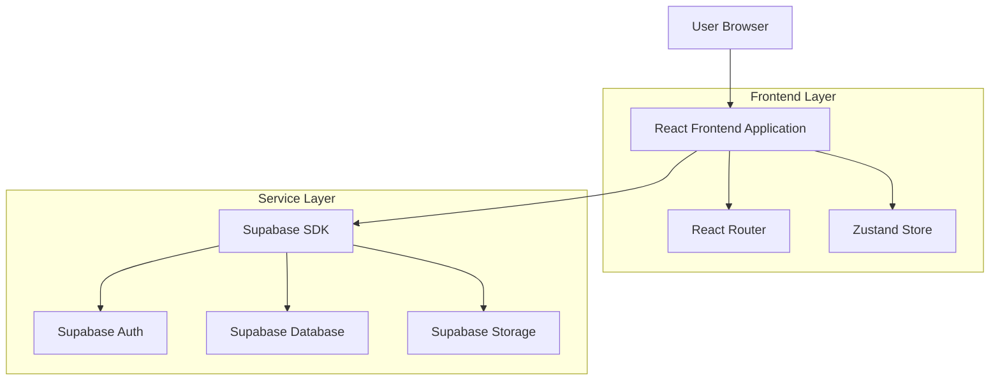
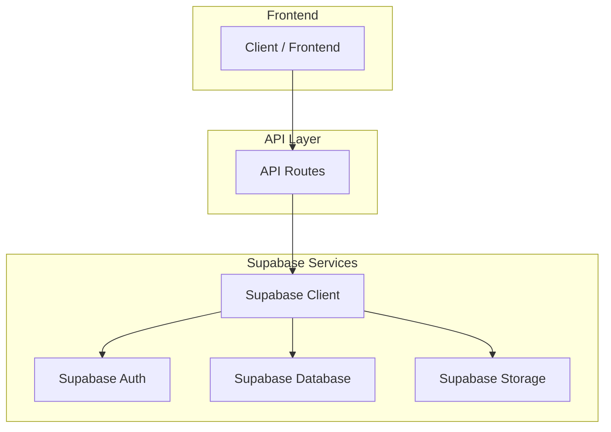
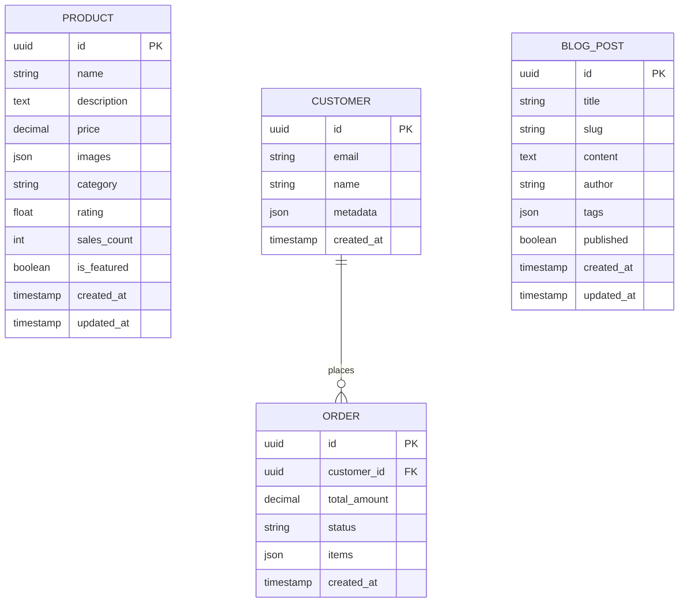

## 1. Architecture Design



## 2. Technology Description
- **Frontend**: React@18 + TypeScript@5 + Vite@5
- **样式**: Tailwind CSS@3 + Headless UI
- **状态管理**: Zustand@4
- **路由**: React Router@6
- **SEO**: React Helmet Async
- **部署**: Vercel
- **后端服务**: Supabase (认证、数据库、存储)

## 3. Route Definitions
| Route | Purpose |
|-------|---------|
| / | 首页，展示公司介绍和主要产品 |
| /products | 产品列表页面 |
| /products/:id | 产品详情页面 |
| /about | 关于我们页面 |
| /contact | 联系页面 |
| /blog | 博客列表页面（预留） |
| /blog/:slug | 博客文章详情页（预留） |
| /privacy | 隐私政策页面 |
| /terms | 服务条款页面 |

## 4. API Definitions

### 4.1 产品相关 API
```
GET /api/products
```

Request:
| Param Name | Param Type | isRequired | Description |
|------------|------------|------------|-------------|
| category | string | false | 产品分类 |
| search | string | false | 搜索关键词 |
| page | number | false | 页码，默认 1 |
| limit | number | false | 每页数量，默认 12 |

Response:
```json
{
  "products": [
    {
      "id": "uuid",
      "name": "Notion 工作区模板",
      "description": "高效的工作区管理模板",
      "price": 99,
      "images": ["url1", "url2"],
      "category": "productivity",
      "rating": 4.8,
      "sales_count": 150
    }
  ],
  "total": 100,
  "page": 1,
  "total_pages": 9
}
```

### 4.2 联系表单 API
```
POST /api/contact
```

Request:
| Param Name | Param Type | isRequired | Description |
|------------|------------|------------|-------------|
| name | string | true | 用户姓名 |
| email | string | true | 用户邮箱 |
| subject | string | true | 邮件主题 |
| message | string | true | 消息内容 |

Response:
```json
{
  "success": true,
  "message": "消息发送成功"
}
```

## 5. Server Architecture Diagram



## 6. Data Model

### 6.1 数据模型定义


### 6.2 数据定义语言

**产品表 (products)**
```sql
CREATE TABLE products (
    id UUID PRIMARY KEY DEFAULT gen_random_uuid(),
    name VARCHAR(255) NOT NULL,
    description TEXT NOT NULL,
    price DECIMAL(10,2) NOT NULL,
    images JSONB DEFAULT '[]',
    category VARCHAR(50) NOT NULL,
    rating DECIMAL(3,2) DEFAULT 0.00,
    sales_count INTEGER DEFAULT 0,
    is_featured BOOLEAN DEFAULT false,
    created_at TIMESTAMP WITH TIME ZONE DEFAULT NOW(),
    updated_at TIMESTAMP WITH TIME ZONE DEFAULT NOW()
);

-- 索引
CREATE INDEX idx_products_category ON products(category);
CREATE INDEX idx_products_featured ON products(is_featured);
CREATE INDEX idx_products_rating ON products(rating DESC);

-- 权限
GRANT SELECT ON products TO anon;
GRANT ALL ON products TO authenticated;
```

**博客文章表 (blog_posts)**
```sql
CREATE TABLE blog_posts (
    id UUID PRIMARY KEY DEFAULT gen_random_uuid(),
    title VARCHAR(255) NOT NULL,
    slug VARCHAR(255) UNIQUE NOT NULL,
    content TEXT NOT NULL,
    author VARCHAR(100) NOT NULL,
    tags JSONB DEFAULT '[]',
    published BOOLEAN DEFAULT false,
    created_at TIMESTAMP WITH TIME ZONE DEFAULT NOW(),
    updated_at TIMESTAMP WITH TIME ZONE DEFAULT NOW()
);

-- 索引
CREATE INDEX idx_blog_posts_slug ON blog_posts(slug);
CREATE INDEX idx_blog_posts_published ON blog_posts(published);
CREATE INDEX idx_blog_posts_created_at ON blog_posts(created_at DESC);

-- 权限
GRANT SELECT ON blog_posts TO anon;
GRANT ALL ON blog_posts TO authenticated;
```

## 7. 项目结构

```
bridge-ai-site/
├── src/
│   ├── components/          # 可复用组件
│   │   ├── ui/             # 基础 UI 组件
│   │   ├── layout/         # 布局组件
│   │   └── sections/       # 页面区块组件
│   ├── pages/              # 页面组件
│   │   ├── Home.tsx
│   │   ├── Products.tsx
│   │   ├── ProductDetail.tsx
│   │   ├── About.tsx
│   │   ├── Contact.tsx
│   │   └── Blog.tsx
│   ├── hooks/              # 自定义 Hooks
│   ├── stores/             # Zustand 状态管理
│   ├── utils/              # 工具函数
│   ├── types/              # TypeScript 类型定义
│   ├── services/           # API 服务
│   ├── styles/             # 全局样式
│   └── main.tsx            # 应用入口
├── public/                 # 静态资源
├── .env.local             # 环境变量
├── vite.config.ts         # Vite 配置
├── tailwind.config.js     # Tailwind 配置
├── tsconfig.json          # TypeScript 配置
└── vercel.json            # Vercel 部署配置
```

## 8. 部署与 CI/CD

### Vercel 部署配置
```json
{
  "buildCommand": "npm run build",
  "outputDirectory": "dist",
  "devCommand": "npm run dev",
  "installCommand": "npm install",
  "framework": "vite"
}
```

### GitHub Actions 工作流
```yaml
name: Deploy to Vercel
on:
  push:
    branches: [main]
  pull_request:
    branches: [main]

jobs:
  deploy:
    runs-on: ubuntu-latest
    steps:
      - uses: actions/checkout@v4
      - uses: actions/setup-node@v4
        with:
          node-version: '18'
      - run: npm ci
      - run: npm run build
      - uses: vercel/action@v2
        with:
          vercel-token: ${{ secrets.VERCEL_TOKEN }}
          vercel-org-id: ${{ secrets.VERCEL_ORG_ID }}
          vercel-project-id: ${{ secrets.VERCEL_PROJECT_ID }}
```

## 9. 性能优化策略

### 代码分割
- 按路由进行代码分割
- 组件懒加载
- 图片懒加载和 WebP 格式

### 缓存策略
- 静态资源长期缓存
- API 响应缓存
- 图片 CDN 优化

### SEO 优化
- 服务端渲染 (SSR) 支持
- 动态 Meta 标签
- 结构化数据标记
- Sitemap 自动生成

## 10. 安全最佳实践

### 前端安全
- XSS 防护
- CSRF 防护
- 输入验证和清理
- HTTPS 强制使用

### 数据安全
- Supabase 行级安全 (RLS)
- API 密钥安全存储
- 敏感数据加密
- 定期安全审计

## 11. 扩展计划

### 第一阶段 (MVP)
- 基础页面和展示功能
- 联系表单
- 产品展示

### 第二阶段
- 支付集成 (Stripe)
- 用户认证系统
- 产品购买和下载

### 第三阶段
- 博客系统
- CMS 集成
- 国际化支持
- 高级分析功能